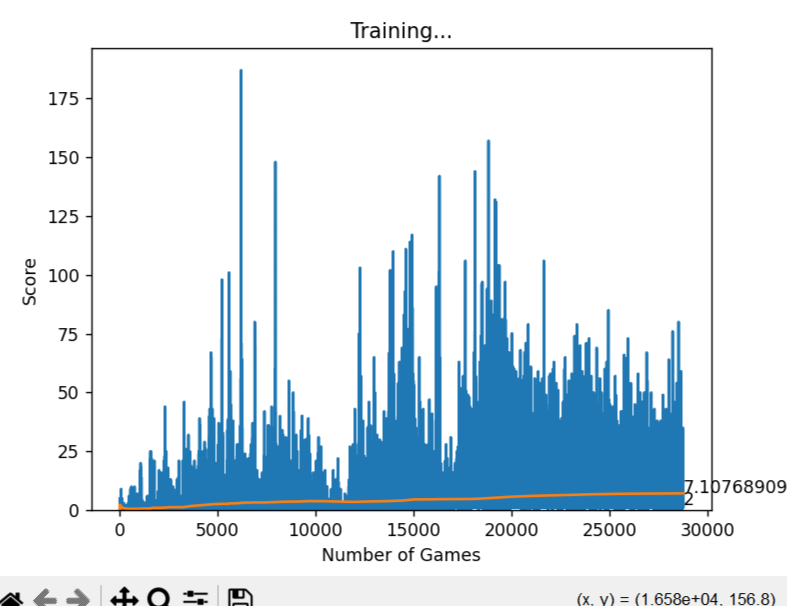

# Runner AI - Deep Q-Learning 🏃‍♂️🤖


An AI agent trained to master the "Pixel Runner" endless runner game using Reinforcement Learning (Deep Q-Network). Built with **Python**, **Pygame**, and **PyTorch**.

## 📋 Description

This project implements a Deep Q-Learning (DQN) algorithm where an AI agent learns to play an endless runner game from scratch. The agent observes the environment (player position, obstacle distance, speed) and decides whether to **Run** or **Jump**.

Through trial and error, the AI optimizes its strategy to maximize the score, eventually learning to time jumps perfectly for different obstacles (Snails and Flies).

## ✨ Features

* **Deep Q-Network (DQN):** Uses a Linear Neural Network with ReLu activation.
* **Optimized State Space:** Inputs are normalized (0-1 range) for faster convergence.
* **Physics Awareness:** The agent tracks vertical velocity (gravity) to understand jump arcs.
* **High-Speed Training:** Uncapped framerate during training to accelerate learning.
* **Real-time Plotting:** Visual graph of scores and average performance during training.


---
## 💿 Requirements

- **pygame:** 2.6.1  
- **torch:** 2.6.0+cu124 
- **numpy:** 1.23.5  
- **matplotlib:** 3.10.6  

---


## 🛠️ Installation

1.  **Clone the repository:**


2.  **Install dependencies:**
    You need Python installed. Run the following to install the required libraries:
    ```bash
    pip install pygame torch numpy matplotlib
    ```

3.  **Assets:**
    Ensure your project folder contains the `graphics` and `audio` folders. The structure should look like this:
    ```text
    Runner-ai/
    ├── graphics/
    ├── font/
    ├── agent.py
    ├── game.py
    ├── model.py
    ├── helper.py
    └── test.py
    ```

## 🚀 Usage

### 1. Train the AI
To start training the agent from scratch:

- Run python agent.py

- A window will open showing the game running at max speed.

- A graph will appear plotting the score per game and the mean score.

- The model saves automatically to ./model/model.pth whenever a new high score is reached.

### 2. Test the Model
To watch the trained AI play at normal speed (60 FPS):

- Run python test.py
- *Note: Ensure you have a model/model.pth file generated from the training step.*

## How it Works

### The Neural Network (DQN)
The model takes 4 inputs (State) and outputs 2 actions.

### State (Inputs)

The inputs are normalized to be between 0 and 1 (or -1 and 1) to help the neural network learn faster.

| Input | Description | Normalization Logic |
| :--- | :--- | :--- |
| **Player Y** | Vertical position of the player | `y / 400` |
| **Distance** | Distance to the next obstacle | `dist / 800` |
| **Obstacle Y** | Height of the next obstacle (Ground/Air) | `y / 300` |
| **Gravity** | Current vertical velocity | `velocity / 20` |


### Actions (Outputs)

The model outputs a probability for:

- [1, 0]- Do Nothing (Run)

- [0, 1]- Jump

### Rewards
- +5: Successfully passing an obstacle.

- +0.01: Every frame the player stays alive.

- -10: Collision with an obstacle (Game Over).


### 📂 File Structure
- **agent.py:** The main entry point for training. Handles the training loop, memory buffer, and state extraction.

- **game.py:** The Pygame environment. Modified to accept AI actions and return rewards/states.

- **model.py:** Defines the PyTorch Linear_QNet architecture and QTrainer.

- **helper.py:** Utility script for plotting the training graph using Matplotlib.

- **test.py:** Loads the saved model for evaluation/demonstration.


## 🤖 Training Steps

### Training




Watch this video [Training (mp4)](https://drive.google.com/file/d/1ZvIlRSXI6iYQxmYkVX96ByAWBlW4EHqt/view?usp=sharing).

---


---

## 📚 For more projects

- GitHub

  [GitHub](https://github.com/saninduhansara)


- LinkedIn

  [LinkedIn](https://www.linkedin.com/in/sanindu-hansara-150297286?utm_source=share&utm_campaign=share_via&utm_content=profile&utm_medium=android_app )
